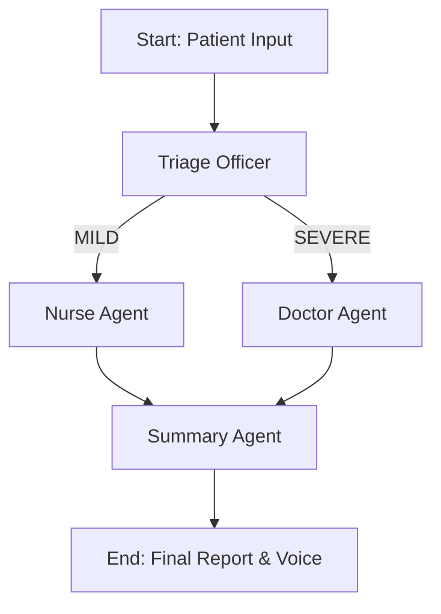

# ⚕️ Agentic AI Doctor: Vision & Voice Enabled Diagnostic Assistant


An advanced, multi-agent medical diagnostic system powered by **LangGraph**, **Groq**, and **Ollama**. This AI assistant can "see" medical conditions via image uploads, "hear" patient concerns through voice input, and provide a structured consultation report using a collaborative team of specialized AI agents.

The working output has been uploaded as a video with the file name : "Video Project - AI AGENT -Healthcare

---

## 🚀 Features

- **🎤 Voice Command**: Speak your symptoms naturally. The system uses **Whisper (via Groq)** for near-instant transcription.
- **👁️ Medical Vision**: Upload images of symptoms (e.g., rashes, infections). The **Doctor Agent** uses vision-capable LLMs to analyze the visual data.
- **🤖 Agentic Collaboration**: 
  - **Triage Officer**: Analyzes severity (MILD vs. SEVERE).
  - **Specialist Doctor**: Handles severe cases with deep visual and symptom analysis.
  - **Registered Nurse**: Provides practical home care and remedies for mild cases.
  - **Coordinator**: Summarizes the entire consultation into a professional report.
- **🔊 Voice Response**: The final consultation report is read back to you using gTTS (Google Text-to-Speech).
- **🎨 Premium UI**: A sleek, modern Gradio interface with responsive tabs and a "health-first" aesthetic.

---

## 🧠 Architecture: The Medical Team

The application uses **LangGraph** to manage a stateful workflow between specialized agents:



1.  **Triage Officer** (Groq llama-3.3-70b): Classifies the case severity.
2.  **Specialist Doctor** (Groq llama-4-scout-17b): Specialized in severe diagnosis using vision.
3.  **Registered Nurse** (Groq llama-3.3-70b): Expert in home care and practical advice.
4.  **Coordinator** (Local Ollama gemma3:12b): Synthesizes all data into a cohesive patient summary.

---

## 🛠️ Tech Stack

- **Framework**: [LangGraph](https://github.com/langchain-ai/langgraph) / [LangChain](https://github.com/langchain-ai/langchain)
- **Models**:
  - LLM & Vision: **Llama 3.3 / Llama 4 (via Groq)**
  - Summary: **Gemma 3 (via local Ollama)**
  - STT: **Whisper Large V3 (via Groq)**
- **UI**: [Gradio](https://gradio.app)
- **Audio**: FFmpeg, PortAudio, gTTS

---

## ⚙️ Installation & Setup

### 1. System Dependencies

The application requires **FFmpeg** and **PortAudio** for audio processing.

#### macOS
```bash
brew install ffmpeg portaudio
```

#### Linux (Ubuntu/Debian)
```bash
sudo apt update && sudo apt install ffmpeg portaudio19-dev
```

#### Windows
1.  **FFmpeg**: Download from [ffmpeg.org](https://ffmpeg.org/download.html) and add the `bin` folder to your System PATH.
2.  **PortAudio**: Download and install binaries or use a package manager like `vcpkg`.

### 2. Python Environment

It is recommended to use **Python 3.11+**.

```bash
# Clone the repository
git clone https://github.com/your-repo/agentic-doctor.git
cd agentic-doctor

# Create a virtual environment
python -m venv venv
source venv/bin/activate  # On Windows: venv\Scripts\activate

# Install dependencies
pip install -r requirements.txt
```

### 3. Environment Variables

Create a `.env` file in the root directory:

```env
GROQ_API_KEY=your_groq_api_key_here
```

### 4. Local Model (Optional but recommended)

To use the **Summary Agent**, ensure [Ollama](https://ollama.com/) is running and pull the Gemma 3 model:

```bash
ollama pull gemma3:12b
```

---

## 🏃 Running the Application

Launch the full integrated experience:

```bash
python gradio_app.py
```

Open the local URL provided by Gradio (typically `http://127.0.0.1:7860`) in your browser.

---

## 📖 Usage Instructions

1.  **Record**: Click the microphone icon and describe your symptoms.
2.  **Upload**: Attach a clear image of the affected area if applicable.
3.  **Analyze**: Click **"ASK THE AI DOCTOR"**.
4.  **Review**: 
    - Check the **Doctor's Analysis** for severe cases.
    - Check the **Nurse's Home Care** for mild cases.
    - Read/Listen to the **Consultation Summary**.

---

## ⚠️ Disclaimer

**This project is for educational and research purposes only.** It is NOT a substitute for professional medical advice, diagnosis, or treatment. Always seek the advice of your physician or other qualified health provider with any questions you may have regarding a medical condition.

---

**Developed by Lisha Vilvanathan**
