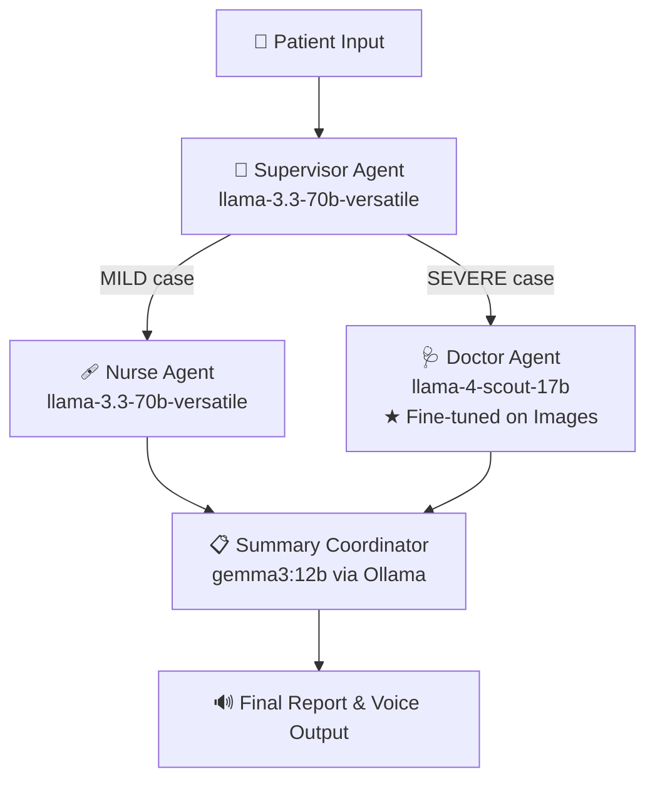

# ⚕️ Agentic AI Doctor: Vision & Voice Enabled Diagnostic Assistant


An advanced, multi-agent medical diagnostic system powered by **LangGraph**, **Groq**, and **Ollama**. This AI assistant can "see" medical conditions via image uploads, "hear" patient concerns through voice input, and provide a structured consultation report using a collaborative team of specialized AI agents — including a **Supervisor Agent** that orchestrates the entire diagnostic workflow.

---

## 🚀 Features

- **🎤 Voice Command**: Speak your symptoms naturally. The system uses **Whisper Large V3 (via Groq)** for near-instant, high-accuracy transcription.
- **👁️ Medical Vision**: Upload images of symptoms (e.g., rashes, infections, scans). The **Doctor Agent** uses a vision-capable, instruction-tuned LLM to analyze visual data.
- **🤖 Agentic Collaboration via LangGraph**:
  - **🔱 Supervisor Agent**: Acts as the central orchestrator — evaluates symptom severity and **delegates** to the appropriate specialist (Doctor or Nurse).
  - **Specialist Doctor**: Handles SEVERE cases with deep visual and symptom analysis using the fine-tuned vision model.
  - **Registered Nurse**: Handles MILD cases with practical home care remedies.
  - **Coordinator**: Synthesizes the entire consultation into a professional patient report.
- **🔊 Voice Response**: The final consultation report is read back to you using gTTS (Google Text-to-Speech).
- **🎨 Premium UI**: A sleek, modern Gradio interface with responsive tabs and a professional health-first aesthetic.

---

## 🧠 Architecture: The Medical Agent Team

The application uses **LangGraph** to manage a stateful, conditional workflow. The **Supervisor Agent** is the entry point that evaluates the case and decides which specialist agent to invoke next.



### Agent Roles

| Agent | Type | Responsibility |
|---|---|---|
| **Supervisor Agent** | 🔱 **Supervisor Agent** | Orchestrates the workflow — classifies severity and delegates to Doctor or Nurse |
| **Specialist Doctor** | Worker Agent | Analyzes SEVERE cases using the fine-tuned vision model |
| **Registered Nurse** | Worker Agent | Provides home care advice for MILD cases |
| **Summary Coordinator** | Worker Agent | Compiles findings into a final patient report (runs locally) |

---

## 🔬 Models Used

This project uses a combination of pre-trained and fine-tuned large language models. **One model in this pipeline has been specifically fine-tuned** — on medical images — to power the visual diagnostics capability.

### 1. ⭐ Fine-Tuned Model — `meta-llama/llama-4-scout-17b-16e-instruct` (via Groq)

> This is the **only fine-tuned model** in the pipeline, and the core of the system's diagnostic power.

| Property | Details |
|---|---|
| **Base Model** | Meta LLaMA 4 Scout 17B (Mixture of Experts, 16 active experts) |
| **Fine-Tuning** | Fine-tuned on medical and clinical image datasets — skin conditions, wounds, rashes, and other visual symptoms — for vision-language understanding |
| **Modality** | Multimodal: accepts both text and images |
| **Role in App** | Performs visual analysis of the uploaded medical image alongside the patient's transcription for SEVERE cases |
| **Why this model** | Its image fine-tuning makes it uniquely capable of interpreting skin conditions, infections, wounds, and scans from uploaded photos — going beyond generic vision models |

---

### 2. Supervisor Agent — `llama-3.3-70b-versatile` (via Groq)

> The **Supervisor Agent** is the orchestrator of the entire multi-agent pipeline. It evaluates the patient's input and decides which specialist to delegate to.

| Property | Details |
|---|---|
| **Base Model** | Meta LLaMA 3.3 70B |
| **Status** | Pre-trained, used as-is (no additional fine-tuning) |
| **Agent Type** | 🔱 **Supervisor Agent** — Controls routing between Doctor and Nurse workers |
| **Role in App** | Classifies case severity (MILD vs SEVERE) and delegates to the appropriate worker agent |

### 3. Summary Coordinator — `gemma3:12b` (via local Ollama)

| Property | Details |
|---|---|
| **Base Model** | Google Gemma 3 12B |
| **Status** | Pre-trained, used as-is (no additional fine-tuning) |
| **Deployment** | Runs **100% locally** via Ollama — no data sent to external servers |
| **Role in App** | Synthesizes findings into a single, cohesive, patient-friendly consultation report |

### 4. Speech-to-Text — `whisper-large-v3` (via Groq)

| Property | Details |
|---|---|
| **Base Model** | OpenAI Whisper Large V3 |
| **Status** | Pre-trained, used as-is (no additional fine-tuning) |
| **Role in App** | Transcribes the patient's recorded voice into text |

---

## 🛠️ Tech Stack

| Layer | Technology |
|---|---|
| **Agent Framework** | [LangGraph](https://github.com/langchain-ai/langgraph) + [LangChain](https://github.com/langchain-ai/langchain) |
| **LLM Inference** | [Groq Cloud API](https://console.groq.com) (ultra-fast LPU inference) |
| **Local LLM** | [Ollama](https://ollama.com) (Gemma 3 12B — fully offline) |
| **Vision LLM** | LLaMA 4 Scout 17B Instruct (multimodal, via Groq) |
| **STT** | Whisper Large V3 (via Groq) |
| **TTS** | Google Text-to-Speech (gTTS) |
| **UI** | [Gradio 5.12](https://gradio.app) |
| **Audio** | FFmpeg, PortAudio, PyDub |

---

## ⚙️ Installation & Setup

### 1. System Dependencies

The application requires **FFmpeg** and **PortAudio** for audio processing.

#### macOS
```bash
brew install ffmpeg portaudio
```

#### Linux (Ubuntu/Debian)
```bash
sudo apt update && sudo apt install ffmpeg portaudio19-dev
```

#### Windows
1. **FFmpeg**: Download from [ffmpeg.org](https://ffmpeg.org/download.html) and add the `bin` folder to your System PATH.
2. **PortAudio**: Download and install binaries or use a package manager like `vcpkg`.

### 2. Python Environment

It is recommended to use **Python 3.11+**.

```bash
# Clone the repository
git clone https://github.com/your-repo/agentic-doctor.git
cd agentic-doctor

# Create a virtual environment
python -m venv venv
source venv/bin/activate  # On Windows: venv\Scripts\activate

# Install dependencies
pip install -r requirements.txt
```

### 3. Environment Variables

Create a `.env` file in the root directory:

```env
GROQ_API_KEY=your_groq_api_key_here
```

Get your free Groq API key at [console.groq.com](https://console.groq.com).

### 4. Local Model (Required for Summary Agent)

Ensure [Ollama](https://ollama.com/) is installed and running, then pull the Gemma 3 model:

```bash
ollama pull gemma3:12b
```

> **Note:** `gemma3:12b` requires approximately **8GB of VRAM** or **16GB of RAM** to run efficiently. If you have hardware constraints, you can substitute with `gemma3:4b` by editing the `summary_agent_node` function in `medical_agents.py`.

---

## 🏃 Running the Application

Launch the full integrated experience:

```bash
python gradio_app.py
```

Open the local URL provided by Gradio (typically `http://127.0.0.1:7860`) in your browser.

---

## 📖 Usage Instructions

1. **Record**: Click the microphone icon and describe your symptoms clearly.
2. **Upload**: Attach a clear image of the affected area if visible.
3. **Analyze**: Click **"ASK THE AI DOCTOR"** and wait for the multi-agent pipeline to process.
4. **Review**:
   - Check the **Doctor's Analysis** tab for SEVERE case diagnosis (vision-based).
   - Check the **Nurse's Home Care** tab for MILD case practical remedies.
   - Read or listen to the **Consultation Summary** generated by the local Gemma 3 model.

---

## ⚠️ Disclaimer

**This project is for educational and research purposes only.** It is NOT a substitute for professional medical advice, diagnosis, or treatment. The AI models used, while powerful, are not certified medical devices. Always seek the advice of your physician or other qualified health provider with any questions you may have regarding a medical condition.

---

**Developed by Lisha Vilvanathan**
